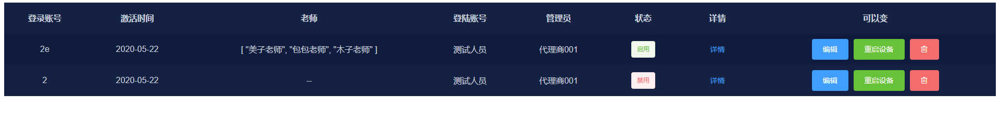

<!--

 * @Descripttion: README
 * @version: 
 * @Author: zml
 * @Date: 2020-05-29 12:13:08
 * @LastEditors: zml
 * @LastEditTime: 2020-06-03 12:21:23
--> 
# table
基于Vue+elementUI深色主题表格组件
## 1. 安装依赖

```
npm install
```

### 2. 运行
```
npm run serve
```

### 3. 部署
```
npm run build
```

## 4. 项目截图



## 5. Demo

> 组件依赖包moment，所以记得先装包：

````javascript
npm install moment --save
````

> template中使用：

````html
 <tables
      :contentKey="contentKey"
      :menu="menu"
      :btnOpt="btnOpt"
      :tableContent="tableContent"
      :tableHead="tableHead"
      @handleChange="handleChange"
    ></tables>
````

> script中使用：

````javascript
import tables from "@/components/ZUI/table";
components: {
	tables
},
````

> data数据示例

````javascript
    data() {
    return {
      tableHead: [
        "登录账号",
        "激活时间",
        "老师",
        "登陆账号",
        "管理员",
        "状态",
        "详情"
      ],
      // 表格中的内容key
      /**
       * 表格中的内容key
       * key 要显示在界面中的项目 必填
       * type接口返回的类型 必填
       * key2 type为object1时必填
       * key3 type为object2
       *
       */
      contentKey: [
        {
          key: "loginName",
          type: "string"
        },
        {
          key: "expireTime",
          type: "moment"
        },
        {
          key: "teacher",
          type: "array"
        },
        {
          key: "organInfoVo",
          type: "object1",
          key2: "sysName"
        },
        {
          key: "organInfoVo",
          type: "object2",
          key2: "userInfoVo",
          key3: "realName"
        },
        {
          key: "status",
          type: "tag",
          tagItem: [
            {
              type: "success",
              value: 1,
              text: "启用"
            },
            {
              type: "danger",
              value: 2,
              text: "禁用"
            }
          ]
        },
        {
          key: "",
          type: "btn",
          btnTxt: "详情",
          btnMethods: "checkDetail",
          methodParams: "我是详情",
          btnType: "text"
        }
      ],
      menu: {
        isShow: true,
        text: "可以变"
      },
      tableContent: [],
      /**
       * 操作栏按钮
       * name {string} 按钮文字
       * type {string} 按钮样式  需要element有该颜色
       * methods {string} 父组件方法
       * icon 是否显示图标 不填则不显示 需要element里面有此图标
       * methods后边的属性是事件 如果想要生效必须在组件中绑定和父组件中注册,如:handleChange
       * 每一个事件有两个参数 第一个是默认有的  第二个是使用者自己传递的  规定为methodParams
       */
      btnOpt: [
        {
          name: "编辑",
          methods: "handleChange",
          type: "primary",
          methodParams: {
            ref: "addOrUpdate",
            type: 1
          }
        },
        {
          name: "重启设备",
          methods: "handleReset",
          type: "success",
          methodParams: {}
        },
        {
          name: null,
          icon: "el-icon-delete",
          type: "danger",
          methods: "handleDel"
        }
      ]
    };
  },
````

> 接口返回数据示例,下方用到的也是此数据

````javascript
"records":[
  {
    "id":"22",
    "loginName":"2e",
    "activateTime":"2",
    "organId":"125323123423917485058",
    "expireTime":"1590076800",
    "teacher":["美子老师","包包老师","木子老师"],
    "organInfoVo":{
      "address":"测试的地址",
      "sysName":"测试人员",
      "userInfoVo":{
        "userId":"125523463822108673",
        "realName":"代理商001",
        "contactPhone":"15975314785"
      }
    }
  },
  {
    "id":"2",
    "loginName":"2",
    "activateTime":"2",
    "organId":"1253231593917485058",
    "expireTime":"1590076800",
     "teacher":["美子老师","包包老师","木子老师"],
    "organInfoVo":{
      "address":"测试的地址",
      "sysName":"测试人员",
      "userInfoVo":{
        "userId":"1255039363822108673",
        "realName":"代理商001",
        "contactPhone":"15975314785"
      }
    }
  }
],

````


## 6. API属性介绍

| 属性名        | 类型   | 默认值                         |                             示例                             |                             解释                             |
| ------------ | ------ | :---------------------------- | :----------------------------------------------------------: | ------------------------------------------------------------ |
| contentKey   | Array  | []                            | 6.1有该属性详细介绍 | tbody展示内容，和tableHead顺序一 一对应（下方6.1有该属性详细介绍） |
| tableHead    | Array  | []                          | [“姓名”，“电话”，“出生日期”，“地址”] | 表头文字内容，和contentKey顺序一一对应 |
| sort         | Object | { isShow: false, text: "序号" } | { isShow: false, text: "序号" } | isShow：是否在左侧显示序号默认false不显示，text：显示后表头文本内容，默认为【序号】 |
| menu         | Object | { isShow: true, text: "操作" }  | { isShow: true, text: "操作" } | isShow：是否显示右侧操作栏 默认true显示，text：显示后表头文本内容，默认为【操作】 |
| tableContent | Array  | []                           |                      后台返回过来的内容                      |                      后台返回过来的内容                      |
| btnOpt       | Array  | []                            |            6.2有该属性详细介绍            |            显示在操作栏下方的按钮，下方6.2有具体介绍            |

## 6.1 contentKey介绍

> tbody展示内容，和`tableHead`顺序一 一对应

| 参数        | 类型   | 是否必填                         |                             参数值                             |                             示例                             |                             解释                             |
| ------------ | ------ | :---------------------------- | :----------------------------------------------------------: | ------------------------------------------------------------ | ------------------------------------------------------------ |
| key   | String  |true                          | 根据接口返回参数变化，type属性值为btn时候可以填写空字符串 `''` | key: "name" | 表头展示内容的key值，值对应的是接口返回数据的参数 |
| type   | String  | true                         | `string` /` object1` / `object2` / `moment` /` tag` / `btn` | type: "string" | tobody中内容展示类型， 具体见下方6.1.1介绍 |
| key2 | String | type值为`object1 `/ `object2`时必填 | 根据接口返回参数变化 | key2: "name" | 表头展示内容的key值，值对应的是接口返回数据的参数，具体见下方6.1.1介绍 |
| key3 | String | type值为`object2`时必填 | 根据接口返回参数变化 | key3: "name" | 表头展示内容的key值，值对应的是接口返回数据的参数，具体见下方6.1.1介绍 |
| tagItem | Array [{  },{ }] | type值为`tag`时必填 | { type:  "success", value:  1, text: "启用" } |     tagItem: [{type: "success",value: 1,text: "启用"},{type: "danger",value: 2,text: "禁用"}]       | tobody中内容展示tag类型的情况判断. 具体见下方6.1.2介绍 |

### 6.1.1 contentKey type值介绍

> 假设我们得到的数据5.Demo中的数据，
>
> 我们想要把`organInfoVo`中的`sysName`显示出来，可以设置key 为organInfoVo  key2为 `sysName`
>
> 我们想要把`organInfoVo`中的userInfoVo 中realName的显示出来，可以设置key 为organInfoVo  key2为 userInfoVo key3属性为realName
>
> 具体设置如下：

````json
  contentKey: [
    {
      "key": "organInfoVo",
      "type": "object1",
      "key2": "sysName"
    },
    {
      "key": "organInfoVo",
      "type": "object2",
      "key2": "userInfoVo",
      "key3": "realName"
    },
  ],

````

### 6.1.2 contentKey tagItem值介绍


> tagItem类型为Array Object形式，里面有如下参数

| 属性  | 值                          | 是否必填 | 介绍     |
| ----- | --------------------------- | -------- | -------- |
| type  | 同Element中el-tag的type属性 | 是       | 颜色     |
| value | 根据项目需要填写            | 是       | 判断条件 |
| text  | 根据项目需要填写            | 是       | 文本内容 |

> 设置示例

````javascript
contentKey: [
  {
    key: "status",
    type: "tag",
    tagItem: [
      {
        type: "success",
        value: 1,
        text: "启用"
      },
      {
        type: "danger",
        value: 2,
        text: "禁用"
      }
    ]
  }
]
````


 ## 6.2 btnOpt 介绍

>   显示在操作栏下方的按钮,有如下参数

| 参数         | 类型   | 是否必填 |          参数值           | 示例                     | 解释                                                         |
| ------------ | ------ | :------- | :-----------------------: | ------------------------ | ------------------------------------------------------------ |
| name         | String | true     |        按需求填写         | name: "编辑",            | 操作栏按钮文本                                               |
| methods      | String | false    |        按需求填写         | methods: "handleChange", | 按钮点击的事件，父组件接收两个参数，当前行的信息 和父组件传递过去的参数同methodParams |
| methodParams | 无限制 | false    |   根据接口返回参数变化    | methodParams: {}         | 事件促发收到的参数                                           |
| type         | String | false    | 同Element中按钮的type属性 |                          | 同Element中按钮的type属性                                    |
| icon         |        | false    | 同Element中按钮的icon属性 |                          | 同Element中按钮的icon属性                                    |

### 